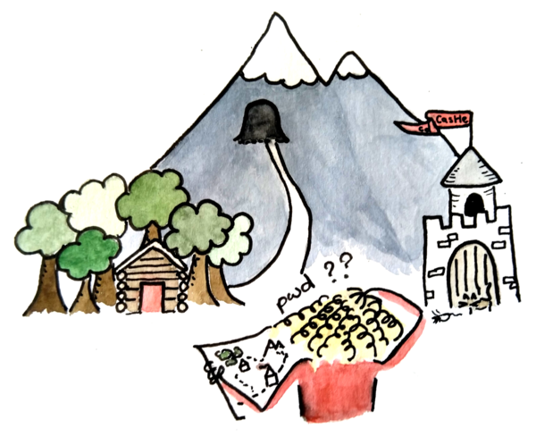
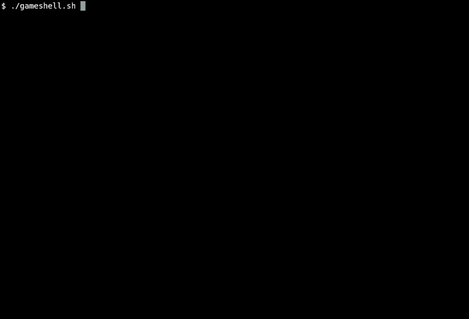

GameShell: yek "bazi" baraye amoozesh-e shell-e Unix
===================================================



Amoozesh-e shoroo-e avval-e daneshjoo-yan-e daneshgah ya danesh-amooz-an
baraye estefade az shell-e Unix, hamishe sadid-o-sabook nist va
bazi vaght-ha khoshgel ham nist. GameShell be onvane yek abzar
taraahi shod ta be danesh-jooyan-e [Daneshgah-e Savoie Mont
Blanc](https://univ-smb.fr) komak kone ba yek shell-e *vaqe'i* ashna
beshan, ba tarz-i ke amoozesh ro tashviz mikonad va dar haman zaman
khoshgel ham hast.

Ide-e asli, ke be Rodolphe Lepigre taa'logh dare, in bud ke yek neshast-e
bash-e estandard ba yek file-e payvast-e monasib ejra beshe, ke "mohemman-ha"
ro tarif mikone ke baraye peyvastan dar bazi "baraasi" mishand.

In natije-ye kar ast...




GameShell be zaban-haye English, French va Italian mojood ast.

Lota fan nazar-ha, so'alat ya pisnahad-haye khodeton ro ba baz kardan-e
[issues](https://github.com/phyver/GameShell/issues) ya ersal-e
[pull requests](https://github.com/phyver/GameShell/pulls) baraye ma
berezid. Ma bisiar be mohemman-haye jadid-i ke shoma misazid علاقهمنd
hastim.


Shoro kardan
------------

GameShell bayad dar hame-ye sistem-haye Linux-e estandard, va dar macOS va
BSD ham kar kone (ama dar in sistem-ha kamtar test shode). Dar Debian ya
Ubuntu, tanha etemadiyat-ha (be joz `bash`) packe-haye `gettext-base` va
`awk` hastand (ke mعمولاً be sorat-e pish-farz nasb shode). Chand
mohemman etemadiyat-haye ezafei darand: in mohemman agar etemadiyat-ha
baravord nashan, rad mishand. Dar Debian ya Ubuntu, dastoor-e zir ro
ejra konid baraye nasb-e hame-ye etemadiyat-haye bazi va mohemman:
```sh
$ sudo apt install gettext man-db procps psmisc nano tree ncal x11-apps wget
```
[rahnamaye karbar](doc/user_manual.md) ro barresi konid baraye didan-e
chegune-nasb-e etemadiyat-ha dar sistem-haye digar (macOS, BSD, ...).

Farz bar in ke hame-ye etemadiyat-ha nasb shode bashand, shoma mitoonid
akhkhin versiyon-e bazi ro ba ejra-e in do dastoor dar terminal emtehan
konid:
```sh
$ wget https://github.com/phyver/GameShell/releases/download/latest/gameshell.sh
$ bash gameshell.sh
```
Dastoor-e avval akhkhin versiyon-e bazi ro be soorat-e yek arshiv-e khod-e
extrakt shodan dahnid, va dastoor-e dovvom bazi ro az arxiv-e dahan-shode
shoru va avaliyat-sazi mikonad. Dastoor-haye chetori bazi kardan be sorat-e
rokhdad dar khode bazi dade mishand.

Be nazar dashtin ke hengami ke bazi ro tark mikonid (ba `control-d` ya
dastoor-e `gsh exit`) peirav-e shoma dar yek arxiv-e jadid (ba naam-e
`gameshell-save.sh`) zakhire mishavad. In arxiv ro ejra konid baraye
edame-e bazi az jayi ke tark kardid.


Agar behtar bedid ke script-haye shell-e khareji ro dar computer-etoon
ejra nakonid, mitoonid yek tasvir-e Docker ba dastoorat-e zir besazid:
```sh
$ mkdir GameShell; cd GameShell
$ wget --quiet https://github.com/phyver/GameShell/releases/download/latest/Dockerfile
$ docker build -t gsh .
$ docker run -it gsh
```
Bazi HENGAMI ke kharej mishavid ZAKHIRE NEMISHAVAD, va gozine-haye ezafei
niazand agar bakhahid barname-haye X-ro az daroon-e GameShell ejra konid.
Be [in bakhsh](./doc/deps.md#running-GameShell-from-a-docker-container) az
rahnamaye karbar morgjaa shavid.


Github Codespaces (ya VSCode)
------------------------------

[](https://codespaces.new/phyver/GameShell)

In repository baraye kar ba goonage [Dev Container](https://containers.dev/)
e Visual Studio Code tarahi shode ke be shoma ejaze midahad GameShell ro
az [Github Codespace](https://github.com/features/codespaces) ejra konid.

Hengami ke Codespace shoru shod (ba zadan-e badge-e bala), shoma
mitoonid GameShell ro dar terminal ba dastoor-e zir ejra konid:
```sh
bash start.sh
```
Zaban-e digari mitoonad ba gozine-e `-L` entekhab beshe. Masalan,
dastoor-e zir bazi ro be zaban-e Farsi shoru mikonad:
```sh
bash start.sh -L fa
```

Baraye gereftan-e tajroobi-e mosavi dar computer-e khodetoon be joz
mohadodat/hazine-haye Codespace, [sanad-e Dev Container](https://containers.dev/supporting#tools)
ro bekheid.


Sanad-ha
--------

Baraye etela'at-e bisiar dar mored-e GameShell, be sanad-haye zir rujoo konid:
- [rahnamaye karbar](doc/user_manual.md) etela'at dare chetori ejra-e
  bazi dar hame-ye platform-haye پشتیبانی shode (Linux, macOS, BSD),
  chetori ejra-e bazi az source-ha, va chetori sakhtan-e arxiv-e bazi-e
  shakhsi (ke baraye estefade-e GameShell baraye dars daadan mofid ast), va
  bisiar chiz-haye digar.
- [rahnamaye barnameh-nosan](doc/dev_manual.md) etela'at dare chetori
  sakhtan-e mohemman-e jadid, chetori tarjomeh-e mohemman-ha, va chetori
  moshtarak shodan dar tose'e-e bazi.


Kist ke GameShell ro tose'e midahad?
------------------------------------

### Barnameh-nosan-ha

Bazi al-haze tavasote in afrad tose'e dade mishavad:
* [Pierre Hyvernat](http://www.lama.univ-smb.fr/~hyvernat) (barnameh-nosan-e
  asli, [pierre.hyvernat@univ-smb.fr](mailto:pierre.hyvernat@univ-smb.fr)),
* [Rodolphe Lepigre](https://lepigre.fr).

### Mohdarin-e mohemman-ha

* Pierre Hyvernat
* Rodolphe Lepigre
* Christophe Raffalli
* Xavier Provencal
* Clovis Eberhart
* Sébastien Tavenas
* Tiemen Duvillard

### Tarjomeh-ha

#### Versiyon-e Farsi (Finglish)

* Shoma (moshtarak shavand)

### Sepaas-e makhsoos

* Hame-ye daneshjoo-yani ke *bisariar* khata dar versiyon-haye avaliyeh
  peyda kardand.
* Joan Stark (ma'roof be, jgs), ke sad-ha piece ASCII-art dar akher-e
  dah-e 90-tarh kard. Bisariar-e ASCII-art-hayi ke dar GameShell
  moshahede mikonid be oon ta'logh dare.


Mojavez
-------

GameShell zir-e mowaze-e [GPLv3](https://www.gnu.org/licenses/gpl-3.0.en.html)
enteshar mishavad.

Lota fan agar GameShell ro estefade mikonid be in repository link bedid.

GameShell open-source ast va estefade-ye an raygan ast. Yeki az tarikh-ha
ke mitoonid zahmat-e an ro be rasad bezarid, ersal-e yek postkard-e
vaghe'i be:

```
  Pierre Hyvernat
  Laboratoire de Mathématiques, CNRS UMR 5127
  Université de Savoie
  73376 Le Bourget du Lac
  FRANCE
```
