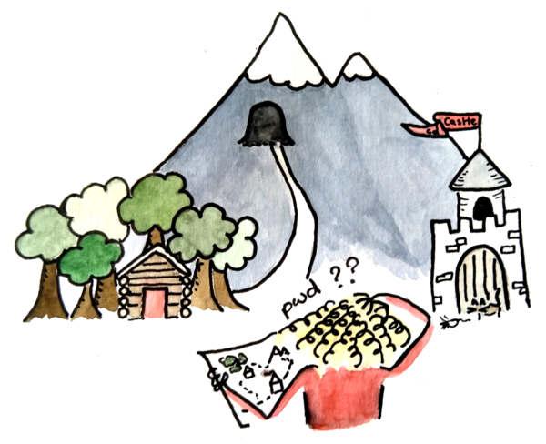
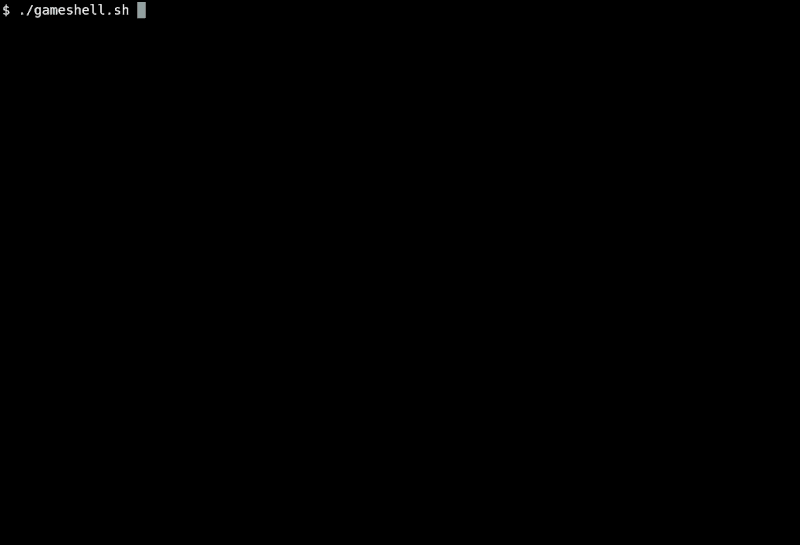

GameShell: a "game" to teach the Unix shell
===========================================



Teaching first-year university students or high schoolers to use a Unix shell
is not always the easiest or most entertaining of tasks. GameShell was devised
as a tool to help students at the
[Université Savoie Mont Blanc](https://univ-smb.fr) to engage with a *real*
shell, in a way that encourages learning while also having fun. 

The original idea, due to Rodolphe Lepigre, was to run a standard bash session
with an appropriate configuration file that defined "missions" which would be
"checked" in order to progress through the game.

Here is the result...




GameShell is available in English, French and Italian.


Feel free to send us your remarks, questions or suggestions by opening
[issues](https://github.com/phyver/GameShell/issues) or submitting
[pull requests](https://github.com/phyver/GameShell/pulls).
We are particularly interested in any new missions you might create!


Getting started
---------------

GameShell should work on any standard Linux system, and also on macOS and BSD
(but we have run fewer tests on the latter systems). On Debian or Ubuntu, the
only dependencies (besides `bash`) are the `gettext-base` and `awk` packages
(the latter is generally installed by default). Some missions have additional
dependencies: these missions will be skipped if the dependencies are not met.
On Debian or Ubuntu, run the following command to install all game and mission
dependencies.
```sh
$ sudo apt install gettext man-db procps psmisc nano tree ncal x11-apps wget
```
Check the [user manual](doc/user_manual.md) to see how to install the game
dependencies on other systems (macOS, BSD, ...).

Assuming all the dependencies are installed, you can try the latest version of
the game by running the following two commands in a terminal.
```sh
$ wget https://github.com/phyver/GameShell/releases/download/latest/gameshell.sh
$ bash gameshell.sh
```
The first command will download the latest version of the game in the form of
a self-extracting archive, and the second command will initialise and run the
game from the downloaded archive. Instructions on how to play are provided in
the game directly.

Note that when you quit the game (with `control-d` or the command `gsh exit`)
your progression will be saved in a new archive (called `gameshell-save.sh`).
Run this archive to resume the game where you left it.


If you prefer not running foreign shell scripts on your computer, you can
generate a Docker image with the following:
```sh
$ mkdir GameShell; cd GameShell
$ wget --quiet https://github.com/phyver/GameShell/releases/download/latest/Dockerfile
$ docker build -t gsh .
$ docker run -it gsh
```
The game will NOT be saved when you exit, and additional flags are required if
you want to run X programs from inside GameShell. Refer to [this
section](./doc/deps.md#running-GameShell-from-a-docker-container) of the user
manual.

Github Codespaces (or VSCode)
-----------------------------

[](https://codespaces.new/phyver/GameShell)

This repository is configured to work with the Visual Studio Code
[Dev Container](https://containers.dev/) extension, which enables GameShell to
be run from a [Github Codespace](https://github.com/features/codespaces).

Once the Codespace is launched (via the above badge), you can run GameShell in
the terminal with the following command.
```sh
bash start.sh
```
An alternative language can be selected using the `-L` option. For example,
the following command will start the game in Italian.
```sh
bash start.sh -L it
```

To get the same experience on your local machine without the limitations/cost
of Codespaces see the [Dev Container docs](https://containers.dev/supporting#tools).

Documentation
-------------

To find out more about GameShell, refer to the following documents:
- The [user manual](doc/user_manual.md) provides information on how to run the
  game on all supported platforms (Linux, macOS, BSD), explains how to run the
  game from the sources, tells you how to generate custom game archives (which
  is useful if you want to use GameShell for teaching a class), and more.
- The [developer manual](doc/dev_manual.md) provides information on how to
  create new missions, how to translate missions, and how to participate
  in the development of the game.


Who is developing GameShell?
----------------------------

### Developers

The game is currently being developed by:
* [Pierre Hyvernat](http://www.lama.univ-smb.fr/~hyvernat) (main developer,
  [pierre.hyvernat@univ-smb.fr](mailto:pierre.hyvernat@univ-smb.fr)),
* [Rodolphe Lepigre](https://lepigre.fr).

### Mission contributors

* Pierre Hyvernat
* Rodolphe Lepigre
* Christophe Raffalli
* Xavier Provencal
* Clovis Eberhart
* Sébastien Tavenas
* Tiemen Duvillard

### Translation

#### Italian Version

* Daniele Scasciafratte (@mte90)
* Paolo Mauri (@maupao)
* Marco Ciampa (@ciampix)
* Antonio Vivace (@avivace)
* Lorenzo Millucci (@lmillucci)
* Sirio Negri (@ziriuz84)
* Domenico Mammola (@domenicomammola)
* Leonardo Canello (@anulo2)
* @michirod
* @serhack
* WhiteShield (@wshield05)
* @gioisco

### Special thanks

* All the students who found *many* bugs in the early versions.
* Joan Stark (a.k.a, jgs), who designed hundreds of ASCII-art pieces in the
  late 90s. Most of the ASCII-art encountered in GameShell are due to her.


Licence
-------

GameShell is released under the [GPLv3](https://www.gnu.org/licenses/gpl-3.0.en.html).

Please link to this repository if you use GameShell.

GameShell is open source and free to use. One way you can acknowledge the work
it required is by sending an actual postcard to

```
  Pierre Hyvernat
  Laboratoire de Mathématiques, CNRS UMR 5127
  Université de Savoie
  73376 Le Bourget du Lac
  FRANCE
```

