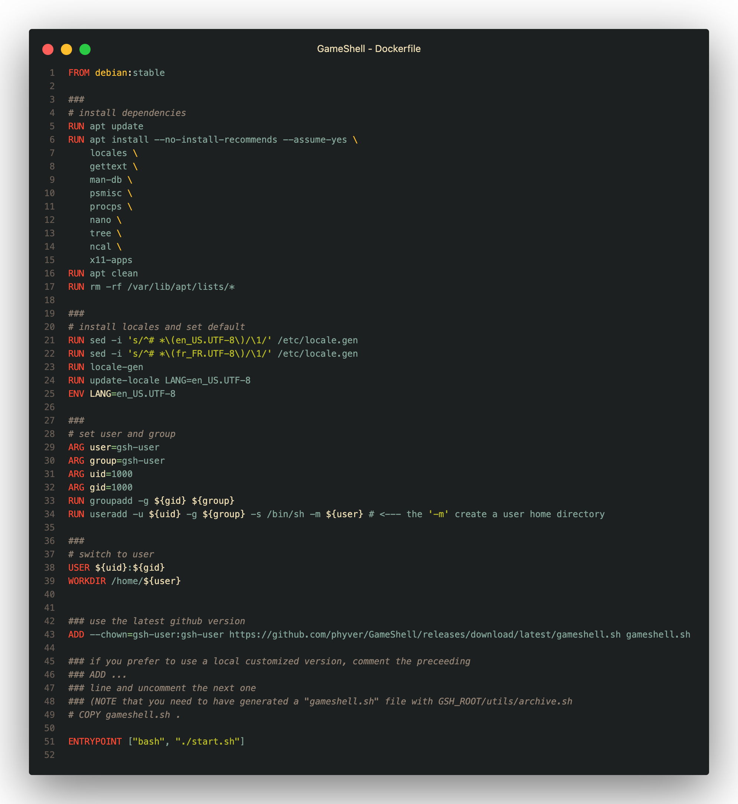
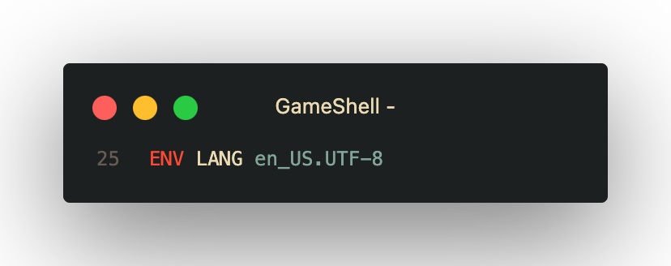
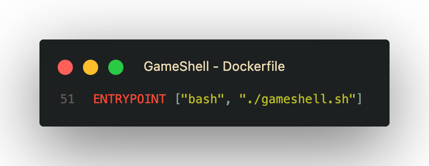
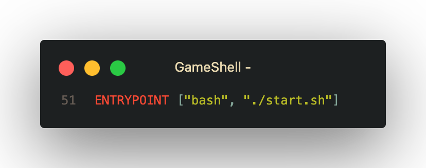

<div align=right>
  
</div>

# GAMESHELL

If you plan to use `docker` to run the game, the main challenge is saving your progress outside the container.
This is possible through `Volume Mount`. It involves mapping the `WORKDIR` of the `docker` image to the project's root directory.

## Table of Contents
- [GAMESHELL](#gameshell)
  - [Table of Contents](#table-of-contents)
  - [Fixing the `Dockerfile`](#fixing-the-dockerfile)
  - [Building the image](#building-the-image)
  - [Running a `container`](#running-a-container)
    - [Restart the container](#restart-the-container)
    - [Mounting a volume to the container](#mounting-a-volume-to-the-container)
      - [What's happening...](#whats-happening)

[](../Dockerfile)
<p align=center>Final blueprint</p>

## Fixing the `Dockerfile`
To begin with, in order to avoid this `warning` during image creation,

```bash
 1 warning found (use docker --debug to expand):
 - LegacyKeyValueFormat: "ENV key=value" should be used instead of legacy "ENV key value" format (line 25)
```

it is necessary to fix the syntax error (although minor) related to the environment variable assignment:


<p align=center>BEFORE</p>

[](./Dockerfile)

<p align=center>AFTER</p>

[](./Dockerfile)

Prochaine étape, le `build`.

## Building the image

```bash
docker build -t gameshell .
```
```dockerfile
[+] Building 8.2s (19/19) FINISHED                                                    docker:desktop-linux
 => [internal] load build definition from Dockerfile                                                  0.1s
 => => transferring dockerfile: 1.25kB                                                                0.0s
 => [internal] load metadata for docker.io/library/debian:stable                                      2.2s
 => [auth] library/debian:pull token for registry-1.docker.io                                         0.0s
 => [internal] load .dockerignore                                                                     0.0s
 => => transferring context: 2B                                                                       0.0s
 => [ 1/13] FROM docker.io/library/debian:stable@sha256:5232bcb7198b44703bc7b1ebb4ea0a9ec5554a650b5e  0.1s
 => => resolve docker.io/library/debian:stable@sha256:5232bcb7198b44703bc7b1ebb4ea0a9ec5554a650b5ea7  0.1s
 => [13/13] ADD --chown=gsh-user:gsh-user https://github.com/phyver/GameShell/releases/download/late  1.3s
 => CACHED [ 2/13] RUN apt update                                                                     0.0s
 => CACHED [ 3/13] RUN apt install --no-install-recommends --assume-yes     locales     gettext       0.0s
 => CACHED [ 4/13] RUN apt clean                                                                      0.0s
 => CACHED [ 5/13] RUN rm -rf /var/lib/apt/lists/*                                                    0.0s
 => CACHED [ 6/13] RUN sed -i 's/^# *\(en_US.UTF-8\)/\1/' /etc/locale.gen                             0.0s
 => CACHED [ 7/13] RUN sed -i 's/^# *\(fr_FR.UTF-8\)/\1/' /etc/locale.gen                             0.0s
 => CACHED [ 8/13] RUN locale-gen                                                                     0.0s
 => CACHED [ 9/13] RUN update-locale LANG=en_US.UTF-8                                                 0.0s
 => CACHED [10/13] RUN groupadd -g 1000 gsh-user                                                      0.0s
 => CACHED [11/13] RUN useradd -u 1000 -g gsh-user -s /bin/sh -m gsh-user # <--- the '-m' create a u  0.0s
 => CACHED [12/13] WORKDIR /home/gsh-user                                                             0.0s
 => CACHED [13/13] ADD --chown=gsh-user:gsh-user https://github.com/phyver/GameShell/releases/downlo  0.0s
 => exporting to image                                                                                4.1s
 => => exporting layers                                                                               0.0s
 => => exporting manifest sha256:eb0dd734a84c6e1b56e9beeb8c8c12d6ff4a5e998c21f0ebe3e5e72aa1e5a8d8     0.0s
 => => exporting config sha256:b8cb7ae60fe701f2fe4fd3f27a83a6e43708c153a7883fa5baa325f6c9f3198a       0.0s
 => => exporting attestation manifest sha256:9109c7f00fe7e018ec04bd74e533be748985006a0474cb75501c378  0.1s
 => => exporting manifest list sha256:b17ace895eb2a67f9ea9d1407c56cb450a36b1fbddd6b5fde126d05c21b0a7  0.0s
 => => naming to docker.io/library/gameshell:latest                                                   0.0s
 => => unpacking to docker.io/library/gameshell:latest                                                3.8s

View build details: docker-desktop://dashboard/build/desktop-linux/desktop-linux/phsp4d6w616lnhbqmarvwyubo
```

Now for the most important part regarding the initial issue: saving progress.

## Running a `container`

Normally, launching the game with an `interactive terminal` should be done like this:

```bash
docker run -it --name gameshell-1 gameshell
```
```bash
  ____                      ____  _          _ _
 / ___| __ _ _ __ ___   ___/ ___|| |__   ___| | |
| |  _ / _` | '_ ` _ \ / _ \___ \| '_ \ / _ \ | |
| |_| | (_| | | | | | |  __/___) | | | |  __/ | |
 \____|\__,_|_| |_| |_|\___|____/|_| |_|\___|_|_|

                             _
                           _/ \
          _               /    \
         / \_   __       /\/\  /\
        /    \ /  \     /    \/  \
       /\/\  /\    `--./.'-    `-.\
      /    \/  ' ^ _    _  _
    /\ ____..      YY  Y     _   |~  _
   /._/  _ \_        Y  Y   [_]--'--[_]
  / / .'/#\_ `-.    Y  YY   |'|""`""|'|
    .-_/#@##\  `\"" ' Y     | | /^\ | |
   " "'"''"'"'''" '         |_|_|I|_|_|

Press Enter to continue.
```

However, progress is only saved within the `container`. It will therefore be impossible to continue from where you left off outside the container.

Two solutions are available to us so far:

### Restart the container

The first option is to restart the same container, then interact with the container's terminal, and finally, once inside the container, launch the script with the saved progress:

```bash
docker start gameshell-1
gameshell-1

docker exec -it gameshell-1 bash
```

```bash
gsh-user@1dd337442de6:~$ ls
gameshell-save.sh  gameshell.sh

gsh-user@1dd337442de6:~$ ./gameshell-save.sh

  |                                    |
--+------------------------------------+--
  | Use the command                    |
  |     $ gsh help                     |
  | to get the list of "gsh" commands. |
--+------------------------------------+--
  |                                    |

[mission 2] $ gsh goal

 __^__                                                                                 __^__
( ___ )-------------------------------------------------------------------------------( ___ )
 |   |                                                                                 |   |
 | / |  Mission goal                                                                   | \ |
 | / |  ============                                                                   | \ |
 | / |                                                                                 | \ |
 | / |  Go the castle's cellar.                                                        | \ |
 | / |                                                                                 | \ |
 | / |                                                                                 | \ |
 | / |  Secondary objective                                                            | \ |
 | / |  -------------------                                                            | \ |
 | / |                                                                                 | \ |
 | / |  Understand the difference between ``cd -`` and ``cd ..``.                      | \ |
 | / |                                                                                 | \ |
 | / |                                                                                 | \ |
 | / |  Useful commands                                                                | \ |
 | / |  ===============                                                                | \ |
 | / |                                                                                 | \ |
 | / |  cd -                                                                           | \ |
 | / |    Jump back to the location you were in prior to your last move.               | \ |
 | / |                                                                                 | \ |
 | / |  cd ..                                                                          | \ |
 | / |    Move to the parent directory (one step back along the path to your current   | \ |
 | / |    location).                                                                   | \ |
 | / |                                                                                 | \ |
 | / |  pwd                                                                            | \ |
 | / |    See the path to your current location.                                       | \ |
 | / |                                                                                 | \ |
 |___|                                                                                 |___|
(_____)-------------------------------------------------------------------------------(_____)


(END)
```
The issue is that if the container is deleted for some reason, your progress will be lost.
The second option is therefore more viable as it allows you to have local progress.

### Mounting a volume to the container

Here we will run the container by mapping the project root to the image's `WORKDIR`. An error may occur during startup, related to the fact that the binary file `./gameshell.sh` would not exist in the root:

```bash
docker run -it --name gameshell-2 -v $(pwd):/home/gsh-user gameshell

bash: ./gameshell.sh: No such file or directory
```

#### What's happening...

The last layer of the image is supposed to start the game immediately after launching the `container`:

[](./Dockerfile)

However, since the binary file doesn't exist in the project root, when mounting the volume, the `WORKDIR` (`/home/gsh-user/`) is overwritten by the root content, which erases the binary file.

To fix this, rather than doing a selective mapping (which would be complicated), we could modify the `Dockerfile`, specifically the `ENTRYPOINT` by replacing `./gameshell.sh` with `./start.sh`.

[](./Dockerfile)

Once modified, the image will need to be rebuilt. Then you'll need to run a new container by mounting the same volume.

`WARNING`: Make sure not to enter `y` as input if you don't want to lose your progress by your own fault.

```bash
docker run -it --name gameshell-1 -v $(pwd):/home/gsh-user gameshell
```
```bash
The directory /home/gsh-user/.config contains meta-data from a previous game.
Do you want to remove it and start a new game? [y/N] n


  |                                    |
--+------------------------------------+--
  | Use the command                    |
  |     $ gsh help                     |
  | to get the list of "gsh" commands. |
--+------------------------------------+--
  |                                    |


~
[mission 24] $ 
```

Happy gaming...